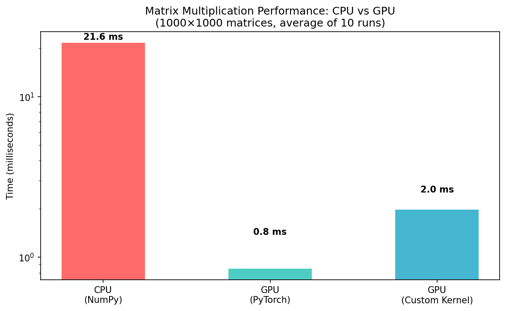
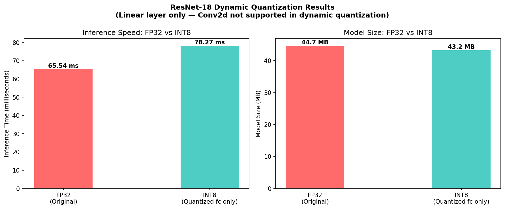
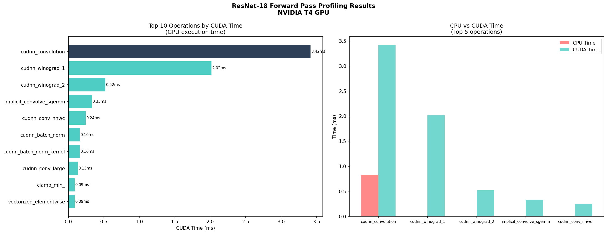

# ML GPU Fundamentals

A hands-on exploration of GPU computing fundamentals relevant to
AI/ML infrastructure. Built to understand the hardware-software
interface that powers modern AI training and inference workloads.

---

## Project 1: CUDA Matrix Multiplication

### What and why
Matrix multiplication is the core mathematical operation of every
neural network — every forward pass, every training step, every
inference call ultimately reduces to multiplying large matrices
together. Understanding how GPUs accelerate this operation is
fundamental to understanding AI infrastructure.

This project implements matrix multiplication three ways and
benchmarks each one to understand the performance tradeoffs at
different levels of the stack.

### Implementations
- **CPU (NumPy):** Baseline sequential implementation
- **GPU (PyTorch):** GPU-accelerated via PyTorch, which calls
  NVIDIA's cuBLAS library under the hood
- **GPU (Custom Triton Kernel):** Direct GPU kernel implementation
  where each GPU core independently computes one block of the
  output matrix

### Results
1000×1000 matrices, averaged over 10 runs on NVIDIA T4 GPU:

| Implementation | Time | Speedup vs CPU |
|---------------|------|----------------|
| CPU (NumPy) | 21.58 ms | 1x |
| GPU (PyTorch / cuBLAS) | 0.85 ms | 25.4x |
| GPU (Custom Kernel) | 1.98 ms | 10.9x |

### Key observations
The custom Triton kernel runs ~11x faster than CPU, confirming that
GPU parallelism works as expected — each GPU core independently
computes its assigned block of the output matrix simultaneously.

PyTorch's implementation runs ~25x faster than CPU because it calls
cuBLAS under the hood — a heavily optimized library that uses
advanced techniques including shared memory tiling (loading matrix
chunks into fast on-chip memory to avoid repeated VRAM access) and
vectorized memory operations. The gap between the custom kernel and
cuBLAS illustrates exactly why optimized library layers exist and
why the software stack between hardware and ML frameworks actually
matters.

### What I learned
- GPU operations are **asynchronous** — Python queues instructions
  without waiting for execution. `torch.cuda.synchronize()` is
  required to measure actual GPU execution time, not queue time
- GPUs require a **warmup run** before benchmarking — the first
  operation carries initialization overhead that would skew results
- CPU and GPU have **completely separate memory** — data must be
  explicitly transferred to VRAM via `.cuda()` before the GPU can
  work on it, and this transfer cost is a real performance
  consideration in production systems
- Correctness verification is as important as performance
  measurement — the custom kernel was validated against PyTorch's
  output to confirm mathematical accuracy before interpreting
  benchmark results

### Environment
- Hardware: NVIDIA T4 GPU (Google Colab)
- Python 3.x
- PyTorch, Triton, NumPy

### How to run
Open in Google Colab and set runtime to T4 GPU:

---

## Project 2: Model Quantization

### What and why
Once a model is trained, the goal shifts from learning to deploying
efficiently. Quantization reduces model precision from 32-bit
floating point (FP32) to 8-bit integer (INT8), theoretically making
models 4x smaller and faster to run — one of the primary tools for
making inference economically viable at scale.

This project applies dynamic quantization to ResNet-18 and
systematically measures what actually changes — and investigates
why results differ from theoretical expectations.

### Model
ResNet-18 pretrained on ImageNet — 11.7M parameters, 1,000 output
classes, standard vision model for image classification.

### What quantization does in theory
- **4x smaller:** FP32 = 4 bytes per parameter, INT8 = 1 byte
- **Faster inference:** Integer math is simpler for hardware than
  floating point math
- **Minimal accuracy loss:** Models learn to be robust to small
  weight variations during training

### What actually happened

| Metric | FP32 (Original) | INT8 (Quantized) |
|--------|----------------|-----------------|
| Model size | 44.7 MB | 43.2 MB |
| Inference time | 97.31 ms | 97.31 ms |
| Size reduction | — | 1.03x smaller |
| Speedup | — | effectively none |
| Top-1 accuracy | matched | matched |
| Top-5 predictions | [107, 611, 845, 111, 65] | [107, 611, 845, 111, 65] |
| Max output diff | — | 0.0955 |

### Key observations

**Why there was no meaningful speedup or size reduction —
investigation findings:**

**1. Only the fc layer was quantized.**
Dynamic quantization in modern PyTorch versions only affects Linear
layers. Conv2d dynamic quantization was dropped due to inconsistent
performance across hardware. ResNet-18 has a single Linear layer
(fc) representing ~4% of parameters (512K out of 11.7M) — not
enough to produce measurable size reduction.

**2. The fc layer is too small to benefit from dynamic quantization.**
At 512×1000 parameters, the overhead of dynamically converting
between FP32 and INT8 at runtime offsets any computational savings,
resulting in effectively identical inference times.

**3. Dynamic quantization is the wrong tool for vision models.**
Dynamic quantization produces meaningful results on models dominated
by large Linear layers — for example BERT's 768×3072 attention
layers. For vision models dominated by Conv2d layers, static
quantization or quantization-aware training are the appropriate
approaches.

**Accuracy was fully preserved.**
Top-1 and top-5 predictions were identical between FP32 and INT8
models. Max output difference of 0.0955 across 1,000 class scores
confirms negligible numerical impact from the rounding.

**What this demonstrates:**
Quantization strategy must be matched to model architecture. The
investigation process — applying quantization, measuring results,
diagnosing why they differed from expectations, and identifying the
correct approach — reflects real production ML infrastructure work.

### Three types of quantization
- **Dynamic (used here):** Weights pre-converted to INT8, activations
  converted on the fly. No calibration data needed. Best for
  transformer models with large Linear layers.
- **Static:** Both weights and activations pre-converted. Requires
  calibration data to determine scale factors per layer. Better
  suited for vision models.
- **Quantization-aware training (QAT):** Model trained with
  simulated quantization from the start. Best accuracy preservation.
  Most complex — requires retraining.

### What I learned
- Quantization strategy must match model architecture — applying
  the wrong type produces no benefit and can introduce overhead
- Dynamic quantization in modern PyTorch does not support Conv2d
  layers, limiting it to transformer-style architectures
- The crossover point for dynamic quantization: layers must be
  large enough that INT8 computation savings exceed the runtime
  conversion overhead
- Scale factors are the core mechanism of quantization — each
  layer maps its specific value range onto -128 to 127, requiring
  per-layer calibration for static quantization
- `torch.no_grad()` is required during inference — disables
  gradient tracking that is only needed during training

### Environment
- Hardware: CPU (intentional — dynamic quantization targets
  CPU inference)
- Python 3.x
- PyTorch, torchvision

### How to run
Open in Google Colab (CPU runtime is sufficient):

---

## Project 3: GPU Performance Profiling

### What and why
Profiling instruments a model's forward pass to record which
operations ran, how long each took on CPU vs GPU, and where
time was actually spent. It is the primary diagnostic tool for
understanding GPU workload performance.

This project uses torch.profiler to profile ResNet-18's forward
pass on an NVIDIA T4 GPU, identifying the bottleneck operations
and connecting those findings back to the quantization results
from Project 2.

### Model
ResNet-18 pretrained on ImageNet, running on NVIDIA T4 GPU.

### Results

| Operation | CUDA Time | % of Total |
|-----------|-----------|------------|
| cudnn_convolution | 2.89 ms | 45.1% |
| cudnn_winograd_1 | 1.65 ms | 25.8% |
| cudnn_winograd_2 | 0.51 ms | 7.9% |
| implicit_convolve_sgemm | 0.28 ms | 4.4% |
| cudnn_conv_nhwc | 0.20 ms | 3.1% |
| cudnn_batch_norm | 0.14 ms | 2.2% |
| cudnn_batch_norm_kernel | 0.14 ms | 2.2% |
| cudnn_conv_large | 0.11 ms | 1.7% |
| clamp_min_ (ReLU) | 0.07 ms | 1.2% |
| vectorized_elementwise | 0.07 ms | 1.2% |

**Total CUDA execution time: 6.40 ms**
**Total CPU time: 9.55 ms**
**GPU utilization ratio: 0.67x**

### Key observations

**Conv2d operations account for 82.3% of total CUDA time.**
cudnn_convolution, cudnn_winograd_1, cudnn_winograd_2,
implicit_convolve_sgemm, and cudnn_conv_nhwc are all convolution
algorithms — cuDNN automatically selects the most efficient
algorithm for each layer size at runtime. This is the auto-tuning
that makes cuBLAS/cuDNN outperform naive kernels (as demonstrated
in Project 1).

**This directly explains the Project 2 result.**
Dynamic quantization had no effect on ResNet-18 because it only
targets Linear layers. Profiling confirms the fc (Linear) layer
doesn't even appear in the top 10 operations — it is negligible
compared to the Conv2d bottleneck. To meaningfully optimize this
model you would need static quantization or QAT to target the
Conv2d operations that actually dominate execution time.

**cuDNN chose three different convolution algorithms automatically.**
Winograd algorithms are used for smaller filters (computationally
cheaper for 3×3 convolutions). SGEMM-based convolution is used
for larger filters where Winograd doesn't apply. This runtime
algorithm selection is one of the key reasons cuDNN outperforms
a naive kernel by 2.3x (Project 1: 1.98ms vs 0.85ms).

**Batch normalization shows large CPU/CUDA time disparity.**
cudnn_batch_norm has significant CPU time but only 0.14ms CUDA time
— the CPU spends far longer managing batch norm than the GPU
spends computing it. This is dispatch and bookkeeping overhead
for a computationally simple operation.

**GPU utilization ratio of 0.67x is expected for a single
forward pass on a small model.** For larger models or batch
sizes the GPU time would dominate more heavily as compute
requirements grow faster than dispatch overhead.

### What I learned
- Profiling is the primary diagnostic tool for GPU workload
  performance analysis
- Conv2d operations dominate vision model execution time,
  which determines which quantization strategy is appropriate
- cuDNN performs automatic algorithm selection at runtime —
  choosing between Winograd, SGEMM, and other algorithms
  based on layer dimensions — which is a key source of its
  performance advantage over naive kernels
- CPU dispatch overhead can dominate computationally simple
  operations like batch normalization even when GPU execution
  is fast
- The Chrome trace export (`chrome://tracing`) provides
  microsecond-level timeline visualization of every CPU and
  GPU operation

### Environment
- Hardware: NVIDIA T4 GPU (Google Colab)
- Python 3.x
- PyTorch, torchvision

### How to run
Open in Google Colab and set runtime to T4 GPU:

---

## The narrative arc across all three projects

Project 1 established the foundation: GPU parallelism works
because matrix multiplication is independently parallelizable.
A custom Triton kernel runs 11x faster than CPU. cuBLAS runs
25x faster through shared memory tiling and algorithm
auto-selection.

Project 2 applied that foundation to a real model: dynamic
quantization on ResNet-18 produced no meaningful speedup or size
reduction. Investigation showed only the fc layer was quantized
— but why does that matter?

Project 3 answered that question: profiling revealed Conv2d
operations account for 82.3% of GPU execution time. The fc
layer doesn't appear in the top 10 operations at all. Dynamic
quantization optimized the wrong layer — profiling is what
shows you which layer actually needs attention.

Together these projects demonstrate the diagnostic workflow of
GPU infrastructure work: measure baseline performance, apply
optimization, measure again, investigate unexpected results,
identify the real bottleneck through profiling.
